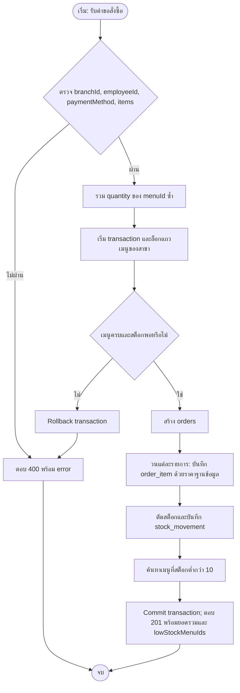

# Workshop สัปดาห์ที่ 9 — ระบบร้านกาแฟ

**รายวิชา:** 88734065 การวิเคราะห์และออกแบบระบบ  
**กลุ่ม/สมาชิก:** cafe-pos-group02
**เอกสารอ้างอิง:** `wk04.md` Use Case ระบบร้านกาแฟ, `wk07-er-diagram.md`, `wk07-schema.sql`, `wk09.md`

> ขอบเขตในเอกสารนี้คือ Use Case “รับออเดอร์และคำนวณราคา” โดยพนักงานหน้าร้านเป็นผู้บันทึกออเดอร์ ใช้ข้อมูลเมนูและสต็อกแยกสาขาตาม Schema สัปดาห์ 7 และปรับจาก endpoint Sprint 1 ที่เดิมคำนวณราคาจากข้อมูล client

## 1. Sequence Diagram ก่อนพัฒนา

Participant: พนักงานหน้าร้าน, หน้าจอ POS, Order API, Order Model และ MySQL ครอบคลุม validation, การรวมจำนวนเมนูซ้ำ, ตรวจสต็อก/ราคาจากฐานข้อมูล, เงื่อนไขสำเร็จ/ไม่สำเร็จ และ loop บันทึกรายการสินค้า

```mermaid
sequenceDiagram
    actor S as พนักงานหน้าร้าน
    participant UI as หน้าจอ POS
    participant API as Order API
    participant M as Order Model
    participant DB as MySQL
    S->>UI: เลือกเมนู จำนวน และวิธีชำระเงิน
    S->>UI: ยืนยันออเดอร์
    activate UI
    UI->>API: POST /api/orders {branchId, employeeId, paymentMethod, items}
    activate API
    alt ข้อมูลไม่ครบหรือรูปแบบไม่ถูกต้อง
        API-->>UI: 400 Bad Request {error}
        UI-->>S: แสดงสาเหตุและให้แก้ข้อมูล
    else ข้อมูลถูกต้อง
        API->>API: รวม quantity ตาม menuId เพื่อเช็กสต็อก
        API->>M: create(branchId, employeeId, paymentMethod, items)
        activate M
        M->>DB: BEGIN; SELECT เมนู/ราคา/สต็อกตาม branchId FOR UPDATE
        activate DB
        DB-->>M: เมนูที่ตรงสาขาพร้อมราคาจริงและสต็อก
        alt เมนูไม่มีในสาขาหรือสต็อกไม่พอ
            M->>DB: ROLLBACK
            DB-->>M: ยกเลิกรายการทั้งหมด
            M-->>API: แจ้งข้อผิดพลาด
            API-->>UI: 400 Bad Request {error}
            UI-->>S: แจ้งรายการที่สั่งไม่ได้
        else เมนูมีและสต็อกพอ
            M->>DB: INSERT orders
            loop แต่ละบรรทัดสินค้าใน items
                M->>DB: INSERT order_item ด้วยราคาจาก menu_item
                M->>DB: UPDATE menu_item หัก stock_quantity
                M->>DB: INSERT stock_movement ติดลบ
            end
            M->>DB: SELECT สต็อกคงเหลือ; COMMIT
            DB-->>M: orderId และสต็อกหลังขาย
            M-->>API: orderId, totalAmount, lowStockMenuIds
            API-->>UI: 201 Created
            UI-->>S: แสดงใบเสร็จและรายการสต็อกต่ำ
        end
        deactivate DB
        deactivate M
    end
    deactivate API
    deactivate UI
```

แผนภาพ PNG ที่แนบชื่อ `wk09-sequence-diagram.png` ใช้ participant และลำดับเดียวกับแผนภาพนี้

## 2. Business Rules และ Flowchart

1. ออเดอร์ต้องมี `branchId`, `employeeId`, วิธีชำระเงินที่รองรับ และรายการสินค้าอย่างน้อยหนึ่งรายการ โดย `menuId` และ `quantity` ต้องเป็นจำนวนเต็มบวก
2. ระบบยอมรับเมนูเฉพาะที่อยู่ในสาขาของออเดอร์ และต้องมีสต็อกพอสำหรับผลรวมจำนวนของ `menuId` ที่ซ้ำกันทุกบรรทัด
3. ราคาต่อหน่วยต้องอ่านจาก `menu_item.price` ในฐานข้อมูล ณ เวลาสั่งซื้อ แล้วเก็บ snapshot ลง `order_item.unit_price`; ไม่รับราคา/ยอดรวมจาก client
4. การสร้าง `orders`, `order_item`, การตัด `menu_item.stock_quantity` และการบันทึก `stock_movement` ต้องสำเร็จหรือ rollback พร้อมกัน
5. หลังขาย หากสต็อกเมนูต่ำกว่า 10 หน่วย ให้ส่ง `menuId` กลับใน `lowStockMenuIds` เพื่อให้ POS แสดงคำเตือน (ตาม scope Sprint 2 ยังไม่เชื่อมอีเมล/Notification Service)



## 3. การ Implement API

โค้ดที่ส่งอยู่ในโฟลเดอร์ `src/` ใช้ Schema สัปดาห์ 7 (`orders.order_id`, `branch_id`, `employee_id`, `order_item`, `stock_movement`) และแยก Controller, Model, Routes ตาม MVC

| API                               | ข้อมูลสำคัญ/เงื่อนไข                                                                                                                                                       |
| --------------------------------- | -------------------------------------------------------------------------------------------------------------------------------------------------------------------------- |
| `GET /api/menu?branchId=1`        | แสดงเมนูเฉพาะสาขา; ต้องระบุ branchId                                                                                                                                       |
| `GET /api/menu/:id?branchId=1`    | ค้นหาเมนูโดยจำกัดสาขา                                                                                                                                                      |
| `POST /api/menu`                  | body ระบุ `branchId, categoryId, name, price, stockQuantity` (รองรับ `category_id`, `stock_quantity` ด้วย); ราคาต้อง > 0 ทศนิยมไม่เกิน 2 ตำแหน่ง                           |
| `PUT /api/menu/:id?branchId=1`    | ต้องระบุ branchId และข้อมูลเมนูครบ; SQL update จำกัดทั้ง menu_id และ branch_id; การเปลี่ยนสต็อกบันทึก stock_movement                                                       |
| `DELETE /api/menu/:id?branchId=1` | จำกัดสาขา; ตอบ 409 เมื่อมีประวัติออเดอร์หรือ stock_movement อ้างอิงเมนู (เมนูที่สร้างด้วยสต็อก > 0 มี movement แล้ว จึงลบไม่ได้ — ใช้ `stockQuantity: 0` เมื่อ demo การลบ) |
| `POST /api/orders`                | รับ branch/employee/payment/items; ไม่รับ unit price จาก client                                                                                                            |
| `GET /api/orders?branchId=1`      | แสดงออเดอร์สาขาที่ระบุและคำนวณยอดจาก order_item                                                                                                                            |

การล็อกแถวด้วย `SELECT ... FOR UPDATE` ร่วมกับ transaction ลด race condition เมื่อมีการขายเมนูเดียวกันพร้อมกัน การรวม quantity ซ้ำก่อนตรวจสต็อกป้องกันการขายเกินจากหลายบรรทัดของเมนูเดียวกัน

## 4. Test Plan และการจับคู่ Diagram กับโค้ด

| กรณีทดสอบ            | คำขอ/การเตรียมข้อมูล                           | ผลที่คาดหวัง                                                 |
| -------------------- | ---------------------------------------------- | ------------------------------------------------------------ |
| อ่านเมนูสาขา         | `GET /api/menu?branchId=1`                     | 200 เฉพาะเมนูสาขา 1                                          |
| ไม่ส่งสาขา           | `GET /api/menu`                                | 400 และไม่ query รายการข้ามสาขา                              |
| สร้างเมนู            | `POST /api/menu` พร้อมข้อมูลครบ                | 201 และคืนเมนูที่สร้าง                                       |
| แก้/ลบข้ามสาขา       | ใช้ menuId สาขา 1 แต่ระบุ branchId=2           | 404; แถวสาขา 1 ไม่เปลี่ยน/ไม่ถูกลบ                           |
| ออเดอร์ปกติ          | `POST /api/orders` ตามตัวอย่างใน README        | 201, ยอดรวมถูกต้อง, สต็อกลดและมี order_item/stock_movement   |
| สต็อกไม่พอ           | สั่ง quantity มากกว่าสต็อก                     | 400; ไม่มี order หรือการเปลี่ยน stock ที่ค้างอยู่ (rollback) |
| menuId ซ้ำหลายบรรทัด | ส่ง menuId เดิม 2 บรรทัด ผลรวมเกินคงเหลือ      | 400 จากการเช็กยอดรวมก่อนสร้าง order                          |
| เปลี่ยนสต็อกผ่านเมนู | PUT โดยเปลี่ยน stock_quantity                  | stock_movement เพิ่มตามผลต่างพร้อมกับการแก้เมนู              |
| ราคาแก้จาก client    | เพิ่มฟิลด์ `unitPrice` ใน body ให้เป็นราคาปลอม | ระบบไม่ใช้ฟิลด์ดังกล่าว; ใช้ `menu_item.price`               |
| เมนูสต็อกต่ำ         | ทำให้ stock หลังขายต่ำกว่า 10                  | 201 และ menuId ปรากฏใน `lowStockMenuIds`                     |

**จับคู่กับ Sequence Diagram:** validation/400 อยู่ใน alt ชั้นนอก; การรวมจำนวนเกิดก่อน Model; Model ล็อก/อ่านข้อมูลและตัดสินเงื่อนไขสต็อกใน alt ชั้นใน; loop ครอบการบันทึก order_item, หักสต็อก และ stock_movement; commit/rollback และ response ตรงกับผลแต่ละเส้นทาง

**สถานะการทดสอบ:** กรณีข้างต้นเป็น test plan พร้อม demo; ต้องรันกับ MySQL และบันทึกหลักฐานจากเครื่อง/ฐานข้อมูลของกลุ่มก่อนส่ง การตรวจในสภาพแวดล้อมนี้ทำได้เฉพาะตรวจ syntax เนื่องจากไม่มีการตั้งค่า MySQL และ `.env` ของกลุ่ม
